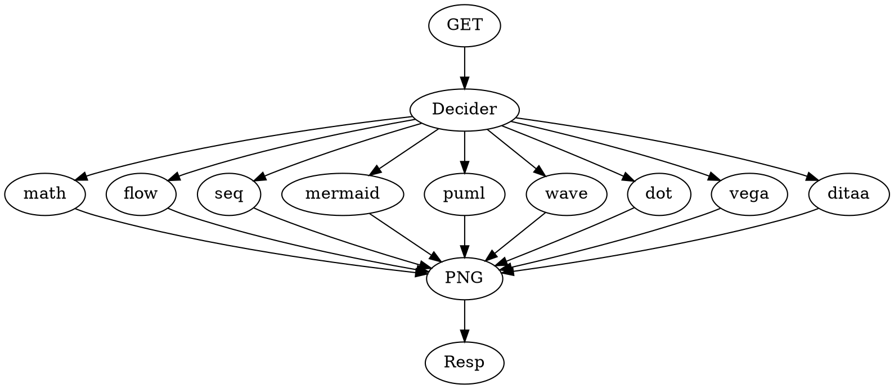

# First Steps and Forward Strategy for Graphing on Zeit

The idea here to come up with a strategy and goal for building out graphing endpoints on zeit.co as inspired by [enhanced markdown preview](https://shd101wyy.github.io/markdown-preview-enhanced/#/)

## Rendering Goals

Currently, the enhanced markdown preview offers rendering for the following mark-ups:

- [KateX / MathJax](https://shd101wyy.github.io/markdown-preview-enhanced/#/math)
- [FlowChart.js](http://flowchart.js.org/)
- [js sequence diagrams](https://bramp.github.io/js-sequence-diagrams/)
- [mermaid](https://github.com/knsv/mermaid)
- [plantuml](http://plantuml.com/)
- [wavedrom](http://wavedrom.com/)
- [graphviz](https://github.com/mdaines/viz.js)
- [vega / vega lit](https://vega.github.io/vega/)
- [ditaa](https://github.com/stathissideris/ditaa)

For further reading, here is the [curated list of awesome visualization](https://github.com/fasouto/awesome-dataviz)

The desired techbical goal is to essentially build graphizo myself for the above 9 renderers:

>NOTE TO SELF: I should build some plugins into this blog site so that I can get proper graph rendering instead of manually copy+pasting stuff into say [vis-js.com](http://viz-js.com/)

## Business Direction

So the question here would be how to make money with this thing. The idea would be to then rent rendering services to corporations and offer them the ability to customize what DNS and domains can hit what save diagram

So... how do we do this? At this point, I'm not too sure, so I'll have some research to do.

A good starting point might be [graphizo's pricing](http://www.gravizo.com/#pricing):

In any case, I think a list of @TODOs in the following order makes sense:

- Step up 2 renderers on zeit
- Step up decider on zeit
- Ensure rendered results can properly show up in slack
- Setup slack bot to automate generating the URL
- Figure out how to setup DNS and CDNs
- Connect with some sort of subscription payment system
- Setup domain
- Test live

## Setting up FlowChart.JS

The rest of this blog will be about me setting up the [FlowChart](https://github.com/adrai/flowchart.js) onto zeit so that I can prove to myself it can be made to generate PNGs

The code for this can be found in my [serverless sandbox](https://github.com/foxnewsnetwork/sandbox-serverless/tree/master/api/flowchart)

- FlowChart.js uses Raphael to draw SVGs
- We must use a SVG to PNG converter such as [this](https://www.npmjs.com/package/convert-svg-to-png) to send down a file from text

From their github, it looks like they straight-up must load chrominum to take a screenshot. I have no idea if this will work in a lambda environment where I am contrained to slug sizes

>It works by using headless Chromium to take a screenshot of the SVG and outputs the buffer. This does mean that the supported output formats is limited to those supported by that the API for headless Chromium, however, as more formats are added, additional packages can easily be created.

## Uh-oh, bad news

After investigation, it seems to properly render FlowChart (and possibly other dom-based things), we can't go full serverless due to cold-boot and slug-size requirements.

This means that I'll have to look into using docker images and containers to string together a bunch of docker services to perform this job. 

I'll have to figure out how to do that in a future blog post
