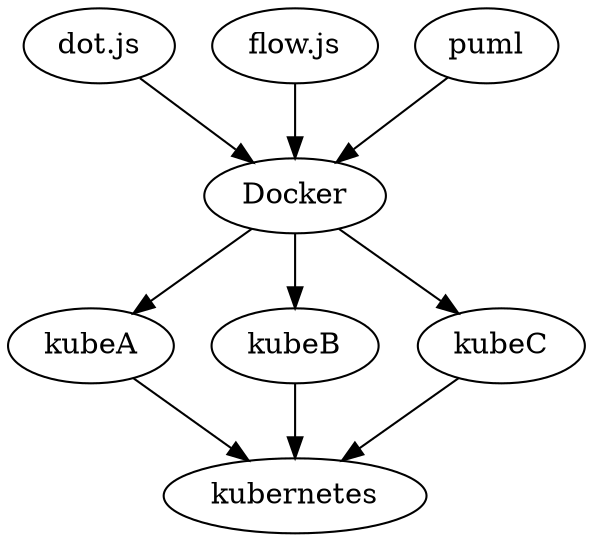

# Introduction to Kubernetes

In my previous post, I experimented with attempting to use zeit.co for lambdas in an attempt to render graphs, however, this did not work out because rendering typically required heavy machinery such as:

- dom
- svg
- canvas

All of this is extremely heavy, and thus not fit for being a lambda. This means that I'll actually have to support managing containers; we start down this road with kubernetes and the [setup tutorial](https://kubernetes.io/docs/tutorials/kubernetes-basics/create-cluster/cluster-interactive/)

# Minikube and kubectrl

- Kubernetes is container management software
- `minikube` and `kubectl` are local machine tools for development

```zsh
$ minikube version
minikube version: v0.34.1
```

## Installing minikube

We start with the [minikube setup guide](https://kubernetes.io/docs/setup/minikube/) and the [minikube installation guide](https://kubernetes.io/docs/tasks/tools/install-minikube/)

- Install a "hypervisor" (which is virtualbox for me)

So before I can start, I will need to install both things onto my local machine


Naturally this leads to my question:

> What is difference between docker and kubernetes?

See [appendix a1](#a1---difference-between-docker-and-kubernetes) for a more detail explanation, but the takeaway is the following:

- Kubernetes is a tool for scaling existing containers across large numbers of machines
  - it is a devops tool for scaling
  - it is *not* a tool needed during development
- Docker is a tool for snap-shotting OS images
  - it *is* what I need to actually setup my desired functionality

Thus, in my next blog post, I will document how to setup and compose docker images to handle my desired functionality of getting graphs and such to render

# Appendix

## A1 - Difference Between Docker and Kubernetes

One thing that really confuses me at the moment is the question: "What even is kubernetes?". According to [this article](https://blog.containership.io/k8svsdocker/),

>From a distance, Docker and Kubernetes can appear to be similar technologies; they both help you run applications within linux containers.

Consider this diagram of software architecture as relevant for me:



In other words

- `dot.js`, `flow.js`, and other such js rendering code live in `container`s
  - `container`s are virtualized operating systems (e.g. linux mint)
- Docker manages the `container`s
  - Enables multiple `container`s to live on a single physical machine
- `kubelet`s can be thought of as physical machines
- `kubernete`s enables multiple `kubelet`s to be deployed
- kubernetes is an alternative to [docker swarm](https://docs.docker.com/engine/swarm/)

## A2 - Unrelated Code Kata Problem

Completely unrelated to anything I'm doing in this blog, I'm also concurrently trying to solve the [domino tiling dynamic programming code kata](https://www.codewars.com/kata/domino-tiling-3-x-n-board/train/javascript)

My current solution is as follows

```javascript
const threeByN = cache(_threeByN)

function cache(fn) { 
  const results = new Map();
  return (n) => {
    if (results.has(n)) { 
      return results.get(n);
    } else { 
      const result = fn(n);
      results.set(n, result);
      return result;
    }
  }
}

function _threeByN(n) {
  if (isEven(n)) { 
    return addM(threeByNEven(n)) ;
  } else {
    return threeByNOdd(n);
  }
}

// 2 possibilities here
// 11**  1***  
// ****  1***
// ****  **** 
function threeByNEven(n) { 
  if (n < 0 || n === 1) { 
    throw new Error(n)
  }
  if (n === 0) {
    return 0;
  }

  return addM(threeByNEven2Top(n), threeByNEven1Long(n))
}

// Takes something like
//   **
// ****
// ****
// and fills it up in the following possible ways
//   **     **
// 11**   1***
// ****   1***
const threeByNEven2Top = cache(_threeByNEven2Top)
function _threeByNEven2Top(n) { 
  if (n < 0 || n === 1) { 
    throw new Error(n)
  }
  if (n === 0) { 
    return 0;
  }
  return addM(threeByNEven2Bot(n), threeByNEven2Long(n-1))
}

// Takes something like
//   **
//   **
// ****
// and fills it the only way possible
//   **
//   **
// 11**
function threeByNEven2Bot(n) { 
  if (n < 0 || n === 1) { 
    throw new Error(n)
  }
  if (n === 2) {
    return 1;
  }
  return threeByNEven(n - 2)
}


// Takes something that looks like:
//  ****
//  ****
// *****
// and fills it in like so:
//  ****
//  ****
// 11***
// Notice how it sorta recurses
function threeByNEven1Long(n) {
  if (n < 0 || n === 1) { 
    throw new Error(n)
  }
  if (n === 0) { 
    return 0;
  }
  return threeByNEven2Long(n - 1)
}

// Takes something like
//   ***
//  ****
//  ****
// and fills it up the only way possible
//  ***   ***
// 1***  11**
// 1***  22**
const threeByNEven2Long = cache(_threeByNEven2Long)
function _threeByNEven2Long(n) { 
  if (n < 0) { 
    throw new Error(n)
  }
  if (n === 1) { 
    return 1;
  }
  if (n === 0) {
    return 0
  }
  return addM(threeByNEven(n - 1), threeByNEven1Long(n - 1))
}

function isEven(n) { 
  return n % 2 === 0;
}

function addM(a, b = 0) {
  return (a + b) % 12345787
}
```

Currently, this solution only partially complete and is missing the following:

- [ ] doesn't work for odd values of `n`
- [ ] can't solve the `10000` case because of a maximum stack size reached

So what I'll need to do is figure out how to overcome the stack-size limit.

I have the following ideas

- [ ] try to use tail-call optimization to compile my code into using `while` loops
- [ ] try to rewrite using generators in order to avoid function calls at all

I should probably continue all of this in its own separate blog post

## A3 - Gatsby Additions

While working on this post, I added the following gatsby plugins

- [gatsby remark graphviz](https://www.gatsbyjs.org/packages/gatsby-remark-graphviz/?=dot)
  - renders `graphviz` charts
- [gatsby-remark-sequence](https://www.gatsbyjs.org/packages/gatsby-remark-sequence/?=seque) 
  - renders `sequence` diagrams
