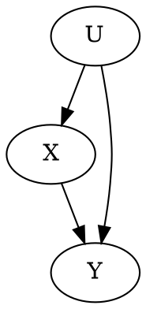

# Introduction

Here, I attempt to solve homework problem 2 of the causality book by Judea Pearl.

## Question 2: 

Given the following network:



I need to add in variables `Z` and `W` such that:

- `Z dep X | W`
- `Z ind U | W`
- `Z`, `W` are ancestors of `Y`, but not `X`

## Tools - d separation

Recall that d-separation is a necessary and sufficient condition for probability independence when the graph is compatible with the distribution.

A path is "blocked" or "d-separated" by a set of nodes `Z` when...

- `i -> m -> j` when `m` is in `Z`
- `i <- m -> j` when `m` is in `Z`
- `i -> m <- j` when `m` all descendants of `m` are NOT in `Z`

## Battle Strategy

Now, my problem is that I have no intuition for where to put `Z` and `W`, and after trying for many pages in my notebook (through essentially brute-forcing), I decided to just write up a program and automate. 

Although I am stupid, and my computer equally stupid, perhaps through the combined hard work of our stupidity, we may yet arrive at the correct solution

### Attempt 1

I'll do this in typescript, and probably just run it in online [typescript editor](https://www.typescriptlang.org/play/index.html)

```typescript
import * as Q from 'utils/queue';
import * as S from 'utils/set';

type Point = 'X' | 'Y' | 'Z' | 'W' | 'U';
type Path = [Point, Point]
type Graph = Set<Path>

const INITIAL_STATE: Graph = new Set([
  ['U', 'X'],
  ['U', 'Y'],
  ['X', 'Y']
]);

const isNeighbor = ([a0, af], [b0, bf]) => {
  return a0 === b0 || // af <- (a0 == b0) --> bf
    a0 === bf || // b0 -> (bf == a0) -> af
    af === b0 || // a0 -> (af == b0) -> bf
    af === bf; // a0 -> (af == bf) <- b0
}

function neighbors(g: Graph, p: Point): Set<P> {
  const _ = S.filter(g, ([_p]) => p === _p)
  return S.map(_, ([_p, n]) => n)
}

function numberOfWaysOut(g: Graph, zs: Set<Point>, p: Point): number {
  // You can always tuck the tail between the legs
  // and scurry back from whence you came
  const goBack = 1;

  const ns = neighbors(g, p)
}

function isBlocked(g: Graph, zs: Set<Point>, start: Point, finish: Point): boolean {
  const nextFn = (next: Point, prev: Point) => {
    const ns = neighbors(g, now)
    return S.filter(ns, n => n !== prev)
  }
  const heurFn = (next: Point, prev: Point) => {
    const goalWeight = next === finish ? 0 : 1;
    return goalWeight / numberOfWaysOut(g, next)
  }
  const path = aStar(nextFn, heurFn, Q.create(start));
  return path.length === 0;
}

type ChildFn<P> = (next: P, prev: P) => Set<P>;
type DistFn<P> = P => number; // number always gte 0

function aStar<P>(chFn: ChildFn<P>, heFn: DistFn<P>, q: PQueue<P>, visited: Array<P> = []): Array<P> {
  UTIL.assert(Q.isPresent(q), "No path possible")

  const best = Q.first(q)
  const [prev] = visited
  const nextPaths = [best, ...visited]
  if (heFn(best) === 0) {
    return nextPaths; // we've reached the goal
  }
  const neighbors = chFn(best, prev);
  const nextQ = S.reduce(children, (queue, child) => {
    return Q.push(queue, heFn(child), child)
  }, Q.pop(q))
  return aStar(chFn, heFn, nextQ, nextPaths);
}

function ancestors(g: Graph, m: Point): Set<Point> {
  const paths = S.filter(g, ([_, me]) => me === m)
  const parents = S.map(paths, ([parent]) => parent)
  return S.reduce(
    parents, 
    (ans, p) => S.union(ans, ancestors(g, p)),
    new Set()
  )
}


```

# Appendix

## A - Priority Queue Implementation

Here's a quick-and-dirty priority queue implementation implemented as a binary tree

```typescript
type PQueue<T> = {
  payload: T,
  priority?: number, // theoretically anything Ord will do
  left?: PQueue<T>,
  right?: PQueue<T>
}

export function first<T>(p: PQueue<T>): T {
  return p.payload;
}
export function pop<T>(p: PQueue<T>): PQueue<T> {
  return merge(p.left, p.right)
}
export function push<T>(p: PQueue<T>, priority: number, payload: T): PQueue<T> {
  return merge(p, { payload, priority })
}
export function create<T>(payload: T): PQueue<T> {
  return { payload, priority: 0 }
}
export function isBlank(x: any): boolean {
  return x === null || x === undefined;
}
export function merge<T>(qLeft?: PQueue<T>, qRight?: PQueue<T>): PQueue<T> {
  if (isBlank(qLeft)) {
    return qRight;
  }
  if (isBlank(qRight)) {
    return qLeft;
  }
  if (priority(qLeft) >= priority(qRight)) {
    const { left, right } = qRight;

    if (priority(right) <= priority(qLeft)) {
      return {
        ...qRight,
        right: merge(right, qLeft)
      }
    } else {
      return {
        ...qRight,
        left: merge(left, qLeft)
      }
    }
  } else {
    return merge(qRight, qLeft)
  }
}
export function priority<T>(q: PQueue<T>?): number {
  return isBlank(q) ? Infinity : q.priority
}
```

## A - Set Utils

Iterator utility functions over `Set`

```typescript
type AccFn<A, B> = (acc: A, ele: B) => A;

export function reduce<T, X>(set: Set<T>, accFn: AccFn<T, X>, init: X): X {
  for (const member of set) {
    init = accFn(init, member)
  }
  return init
}
export function filter<T>(set: Set<T>, checkFn: T => boolean): Set<T> {
  return reduce(
    set,
    (out, m) => checkFn(m) ? set.add(m) : set,
    new Set()
  )
}
export function map<T, X>(set: Set<T>, fn: T => X): Set<X> {
  return reduce(
    set, 
    (out, m) => out.add(fn(m)), 
    new Set()
  )
}
export function union<T>(sA: Set<T>, sB: Set<T>): Set<T> {
  return reduce(
    sB,
    (out, m) => out.add(m),
    new Set(sA)
  )
}
export function any<T>(set: Set<T>, checkFn: T => boolean) {
  return isEmpty(filter(set, checkFn))
}
export function notAny<T>(set: Set<T>, checkFn: T => boolean) {
  return !any(set, checkFn)
}
export function isEmpty<T>(set: Set<T>): boolean {
  return !isPresent(set)
}
export function isPresent<T>(set: Set<T>): boolean {
  return set.size > 0
}
```
